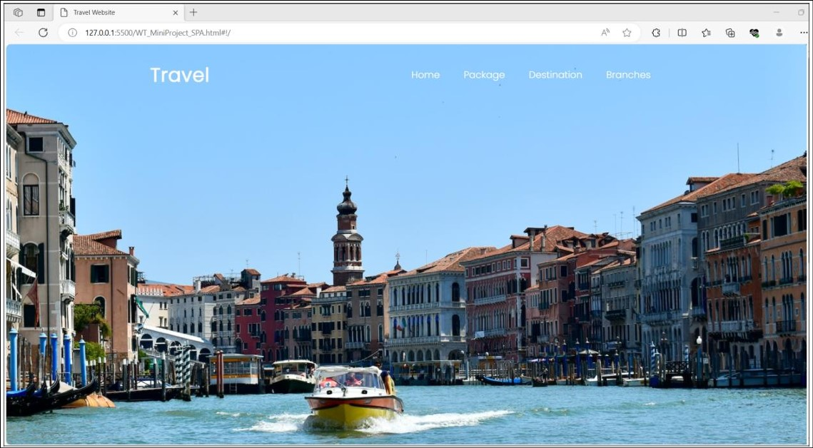
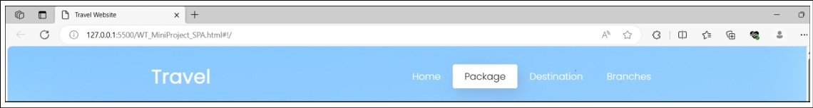
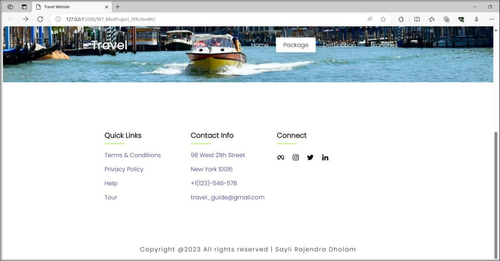

# Tourism_Website
This is a website based on the travel & tourism theme which is developed using 
html, css, JavaScript(angular js) which implements the SPA(Single Page 
Application) concept. It uses ngRoute for routing some of the pages.  
 

## Structure of the SPA: 
- Header : 
Default homepage background 
 
- Dynamic div :  
Generated on button click via ngRoute command, includes 5 routing links:
 
- Footer, Copyright & Owner name  :   
Includes external non routing hyperlink references
 

## What is SPA: 
A Single Page Application (SPA) is a web application or website that interacts with the user by dynamically rewriting the current web page with new data from the web server, instead of loading entire new pages. This approach allows for a more fluid user experience, similar to that of a desktop application, because it does not require full page reloads for user interactions and navigations.
  

## How SPA works: 
1. Initial Load:  The server sends a single HTML file, along with CSS and JavaScript files.

2. Rendering:  JavaScript frameworks like React, Angular, or Vue.js handle the rendering of the user interface in the browser.

3. Data Fetching:  Data is fetched asynchronously from the server via APIs, typically using AJAX or fetch.

4. Client-Side Routing:  Navigation within the application is managed on the client-side without full page reloads.

5. Updates:  Only parts of the page are updated dynamically based on user interactions, enhancing the user experience.
 

### Node.js setup:
1. Download and Install Node.js:
   - Download the installer from the Node.js website.
   - Run the installer and follow the prompts.

2. Verify the Installation:
   - Open Command Prompt or PowerShell and run node -v and npm -v.

3. Create a Simple Node.js Application:
   - Set up a new project directory.
   - Initialize the project with npm init -y.
   - Create an app.js file with the HTTP server code.

4. Run the Application:
   - Use node app.js to start the server.
   - Open your browser and navigate 

 

## Website: 

 *Website default view*

 

 *Header*

 

 *Footer*

